# Introduction
{:.no_toc}

<!-- This is a comment. -->

Signaling pathways are most commonly altered across different tumor types. Many tumors possess at Least one driver alteration and nearly half of such alterations are potentially targeted by currently available drugs. A recent study in TCGA tumors has identified patterns of somatic variations and mechanisms in 10 canonical pathways(Sanchez-Vega et al. 2018). One-third of these tumors possess multiple alterations and have potentially complex phenotypes. Identifying a transcriptomic signature in these tumors would enable personalized therapeutic design strategies.A plethora of evidence suggests complex diseases, like cancer, can be the result of multiple genetic aberrations in biological networks or pathways rather than variation in a single gene. Often starter mutations occur in a key component network that ultimately leads to multigene dysregulation causing hallmark cancer phenotypes (Hanahan and Weinberg 2000). Many of these phenotypes are the result of disrupted transcriptional programs that affect the clinical progression and therapeutic responsiveness. Recent progress in exploring these transcriptomic changes in cancer pathogenesis provided useful clues in precision medicine (Bradner et al. 2017).

The RTK/RAS/PI3K molecular genetic axis controls critical cellular functions and is commonly altered in various cancers (Fruman and Rommel 2014). Perturbations across this axis can lead to deficiencies in cell-cycle, survival, metabolism, motility and genome stability, triggering hallmark phenotypes of cancer. The constitutive activation and presence of phosphatidylinositol-3,4,5-trisphosphate (PIP3) trigger membrane-bound onco-signalosomes. This presents significant challenges for treatment, as PI3K cascade can be activated in several ways (Zhao and Roberts 2006).

In this tutorial we plan to measure aberrant PI3K pathway activity in TCGA dataset using RNASeq information and mutational and copy number information of following frequently altered genes. We named this tutorial as Pancancer Aberrant Pathway Activity Analysis (PAPAA)

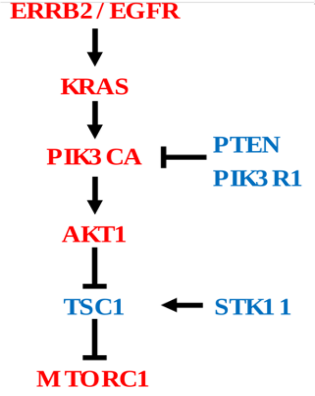

Cancer driver genes comprising both oncogenes(OG) and Tumor suppressor genes(TSG) share common phenotypical outcome. However they often have divergent molecular mechanisms  that drive the outcome. We are interested in capturing mutational specific differential transcriptional outcome among OG and TSG. In Fig-1 Genes in red are oncogenes (have activating or copy gain) and blue are tumor suppersor genes (have inactivating or copy loss).

> ### Agenda
>
> In this tutorial, we will cover:
>
> 1. TOC
> {:toc}
>
{: .agenda}

# **Get data**

> ###  Hands-on: Data upload
>
> 1. Create a new history for this tutorial
> 2. Import the files from [PAPAA-Zenodo](https://zenodo.org/record/3632117#.Xjh96ZNKi-V) or from the shared data library
>
>    ```
    https://zenodo.org/record/3632117/files/CCLE_DepMap_18Q1_maf_20180207.txt.gz
	https://zenodo.org/record/3632117/files/CCLE_MUT_CNA_AMP_DEL_binary_Revealer.tsv.gz
	https://zenodo.org/record/3632117/files/ccle_rnaseq_genes_rpkm_20180929_mod.tsv.gz
	https://zenodo.org/record/3632117/files/compounds_of_interest.txt
	https://zenodo.org/record/3632117/files/copy_number_gain_status.tsv.gz
	https://zenodo.org/record/3632117/files/copy_number_loss_status.tsv.gz
	https://zenodo.org/record/3632117/files/gdsc1_ccle_pharm_fitted_dose_data.txt.gz
	https://zenodo.org/record/3632117/files/gdsc2_ccle_pharm_fitted_dose_data.txt.gz
	https://zenodo.org/record/3632117/files/GDSC_CCLE_common_mut_cnv_binary.tsv.gz
	https://zenodo.org/record/3632117/files/GDSC_EXP_CCLE_converted_name.tsv.gz
	https://zenodo.org/record/3632117/files/mc3.v0.2.8.PUBLIC.maf.gz
	https://zenodo.org/record/3632117/files/mutation_burden_freeze.tsv
	https://zenodo.org/record/3632117/files/pancan_mutation_freeze.tsv.gz
	https://zenodo.org/record/3632117/files/pancan_rnaseq_freeze.tsv.gz
	https://zenodo.org/record/3632117/files/path_genes.txt
	https://zenodo.org/record/3632117/files/sample_freeze.tsv
	https://zenodo.org/record/3632117/files/seg_based_scores.tsv
	https://zenodo.org/record/3632117/files/sign.txt
	https://zenodo.org/record/3632117/files/vlog_trans.csv
	https://zenodo.org/record/3632117/files/vogelstein_cancergenes.tsv
	https://zenodo.org/record/3632117/files/tcga_dictionary.tsv
    ```
>    ***TODO***: *Add the files by the ones on Zenodo here (if not added)*
>
>    ***TODO***: *Remove the useless files (if added)*
>
>    
>    
>
> 3. Rename the datasets
> 4. Check that the datatype
>
>    
>
> 5. Add to each database a tag corresponding to ...
>
>    
>
{: .hands_on}

# **Pancancer aberrant pathway activity analysis (PAPAA)** 

Machine Learning use learning features from datasets and generate predictive models. Extracting transcriptional patterns and learning insights from this abundance of data is a developing research area. Transcriptional profiling was used to identify differentially expressed genes and pathways associated with drug resistance in breast cancer (Men et al. 2018). Such perturbations in oncogenic pathways can be useful in predicting sensitivity to therapeutic agents (Bild et al. 2006). Machine learning-based modeling provides a systematic manner to leverage these multi-omic data to predict phenotype or stratify tumors based on gene expression and pathway variations. We extended a previously developed elastic net penalized logistic regression classification modeling approach to derive transcription signature or pathway alterations to measure aberrant PI3K activity in the pan-cancer data(Way et al. 2018). This method integrates bulk RNA Sequencing (RNA-Seq), copy number and mutation data from PanCanAtlas (https://gdc.cancer.gov/). 

TCGA Pancancer has uniformly processed Multi-omics data including RNASeq, copynumber and mutational data. It covers 33 different cancer types and having information from over 10000 samples. We used publicly available RNASeq, mutation and CNV data sets from TCGA. Description and processing details of these data sets are listed at this site: [Pancancer analysis](https://github.com/nvk747/pancancer.git)

***Machine learning methodology***
Logistic regression is a kind of machine learning approcah where statistical analysis that is used to predict the outcome of a dependent variable based on prior observations. Changes in gene expression are direcly connected to alterations/mutations in genes. we used above appoach to predict mutational status given the gene expression. Optimizing to the above prediciton of mutational status with gene expression variable, we used elatic net penalty with gradient descent algorithm is used to find the optimal cost function by going over a number of iterations. The objective of the classifier is to determine the probability a given sample (i) has a aberrant gene event given the sample’s RNaseq measurements (Xi). In order to achieve the objective, the classifier learns a vector of coefficients or gene-specific weights (w) that optimize the following penalized logistic function.

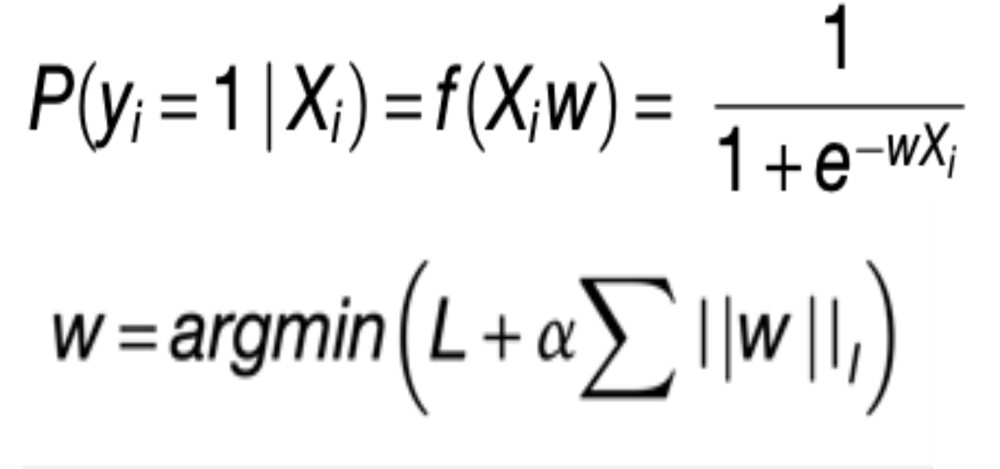

Where alpha and l are regularization and elastic net mixing hyperparameters that are only active during training. Each model was tested at multiple alpha and l values and cross vaidated was performed.  

***Sample Processing step:***

*x-matrix*
> Gene-expression data comprises of expression levels for ~20000 genes in ~10000 samples. Top 8000 highly variable genes between the samples were measured by median absolute deviation (MAD) and considered for analysis. 

*y-matrix*
> copy number and mutational data in the binary format for all samples. This set is sorted to given pathway target genes and cancer types. 

We then randomly held out 10% of the samples to create a test set and rest 90% for training.  Testing set is used as the validation to evaluate the performance of any machine learning algorithm and the remaining parts are used for learning/training. The training set is balanced for different cancer-types and PI3K status. 

Predicting probabilities of an observation belonging to each class in a classification problem is more flexible rather than predicting classes directly. This method has an added advantage to tradeoff errors made by the model as it depends on interpretion of probabilities using different thresholds. Two diagnostic tools that help in the interpretation of probabilistic forecast for binary (two-class) classification predictive modeling problems are ROC Curves and Precision-Recall curves. Each model generated is evaluated and performance metrics is measured using AUROC and AUPR.

As elatic net penalty with stochastic decent gradient apporach induces sparsity in the number of features used in classification, and the best/top features (genes) are likely to represent transcriptional signature of given disease or aberrant activity of the mutated genes in a pathway. 

Each feature (gene) is given a rank and score(negative or positive) depending on its contribution to classifcation. The positve scored genes are likely to be upregulated in activated pathway samples and negatively scored genes are likely to be downsteam targets of altered pathways. 

In this tutorial, we made series of steps to generate classification models and used those models for predicting pharmocological response or identifying potential biomarkers that are helpful in for treatment of various cancers. Generate model using from ERBB2,KRAS,PIK3CA,AKT11 oncogenes from ERK/RAS/PI3K signalling axis pathway. 
have fun!

## **PanCancer_classifier**
This first step is designed to generate model with ERBB2,KRAS,PIK3CA,AKT11 genes belonging to a ERK/RAS/PI3K signalling axis pathway(path_genes) and BLCA,BRCA,CESC,COAD,ESCA,LUAD,LUSC,OV,PRAD,READ,STAD,UCEC,UCS cancer types/diseases(ref: tcga_dictionary.tsv) from The Cancer Genome Atlas (TCGA). Additionally the generated model was used to evaluate alternative genes (PTEN,PIK3R1,STK11) and alternative dieseases (BRCA,COAD,ESCA,HNSC,LGG,LUAD,LUSC,PRAD,READ,GBM,UCEC,UCS) performance. This steps takes feature information (pancan_rnaseq_freeze.tsv.gz), mutational information(pancan_mutation_freeze.tsv.gz),load of mutations in each samples(mutation_burden_freeze.tsv.gz), threshold passed sample information(sample_freeze.tsv) and copy number information(copy_number_loss_status.tsv.gz & copy_number_gain_status.tsv.gz).
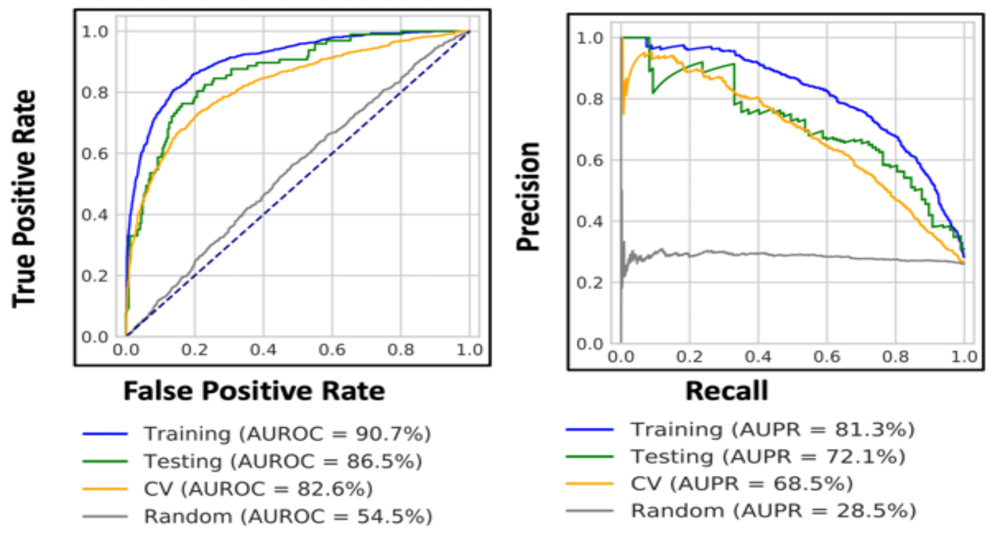 
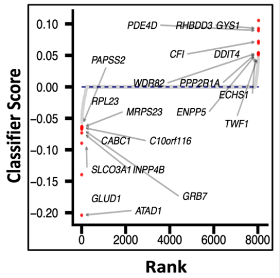


> ###  Hands-on: Generating model from ERBB2,PIK3CA,KRAS,AKT1 genes
>
> 1. **PanCancer_classifier**  with the following parameters:
>    -  *"Filename of features to use in model"*: `output` (pancan_rnaseq_freeze.tsv.gz)
>    - *"Treat X matrix as 'raw'"*: `Yes`
>    -  *"Filename mutations"*: `output` (Input dataset)
>    -  *"Filename of mutation burden"*: `output` (Input dataset)
>    -  *"Filename of sample"*: `output` (Input dataset)
>    - *"Comma separated string of HUGO gene symbols"*: `ERBB2,PIK3CA,KRAS,AKT1`
>    - *"Comma sep string of TCGA disease acronyms. If no arguments are passed, filtering will default to options given in --filter_count and --filter_prop."*: `BLCA,BRCA,CESC,COAD,ESCA,LUAD,LUSC,OV,PRAD,READ,STAD,UCEC,UCS`
>    - *"Decision to drop input genes from X matrix"*: `Yes`
>    - *"Supplement Y matrix with copy number events"*: `Yes`
>    - *"the alphas for parameter sweep"*: `0.1,0.13,0.15,0.18,0.2,0.3,0.4,0.6,0.7`
>    - *"the l1 ratios for parameter sweep"*: `0.1,0.125,0.15,0.2,0.25,0.3,0.35`
>    - *"alternative genes to test performance"*: `PTEN,PIK3R1,STK11`
>    - *"The alternative diseases to test performance"*: `BRCA,COAD,ESCA,HNSC,LGG,LUAD,LUSC,PRAD,READ,GBM,UCEC,UCS`
>    - *"Remove hypermutated samples"*: `Yes`
>    - *"Keep intermediate ROC values for plotting"*: `Yes`
>    - *"Shuffle the input gene exprs matrix alongside"*: `Yes`
{: .hands_on}

>    *Check parameter descriptions*
>
	Pancancer_Aberrant_Pathway_Activity_Analysis scripts/pancancer_classifier.py:
        --genes             comma separated string of HUGO symbols for target genes or targenes_list.csv file
        --diseases          comma separated string of disease types/TCGA acronyms for classifier
        --folds             number of cross validation folds
        --drop              drop the input genes from the X matrix
        --copy_number       optional flag to supplement copy number to define Y
        --filter_count      int of low count of mutation to include disease
        --filter_prop       float of low proportion of mutated samples per disease
        --num_features      int of number of genes to include in classifier
        --alphas            comma separated string of alphas to test in pipeline
        --l1_ratios         comma separated string of l1 parameters to test
        --alt_genes         comma separated string of alternative genes to test
        --alt_diseases      comma separated string of alternative diseases to test
        --alt_filter_count  int of low count of mutations to include alt_diseases
        --alt_filter_prop   float of low proportion of mutated samples alt_disease
        --alt_folder        string of where to save the classifier figures
        --remove_hyper      store_true: remove hypermutated samples
        --keep_intermediate store_true: keep intermediate roc curve items
        --x_matrix          string of which feature matrix to use
        --classifier_folder String of the location of classifier data
        
        Output:
        - ROC curves
        pan_model performance for all diseases        
        alt_gene performance for all diseases
        - AUROC across diseases
        pan model performance for each disease
        Train,Test,CV,random performance for each disease
        - classifier coefficients
        over all classifier summary 
        summary counts and propotions for target genes in each disease 
{: .hands_on}

## **within_disease_analysis**
This step is designed to generate individual pan-within models for each individual disease. It takes the same inputs as first step and generates similar output for each of them.

> ###  Hands-on: Generating models for individual diseases listed for ERBB2,PIK3CA,KRAS,AKT1
>
> 1. **PanCancer_within_disease_analysis**  with the following parameters:
>    -  *"Classifier data"*: `output_alt_folder` (output of **PanCancer_classifier** )
>    -  *"Filename of features to use in model"*: `output` (Input dataset)
>    - *"Treat X matrix as 'raw'"*: `Yes`
>    -  *"Filename mutations"*: `output` (Input dataset)
>    -  *"Filename of mutation burden"*: `output` (Input dataset)
>    -  *"Filename of sample"*: `output` (Input dataset)
>    - *"Comma separated string of HUGO gene symbols"*: `ERBB2,PIK3CA,KRAS,AKT1`
>    - *"Comma sep string of TCGA disease acronyms. If no arguments are passed, filtering will default to options given in --filter_count and --filter_prop."*: `BLCA,BRCA,CESC,COAD,ESCA,LUAD,LUSC,OV,PRAD,READ,STAD,UCEC,UCS`
>    -  *"File with Copy number loss"*: `output` (Input dataset)
>    -  *"File with Copy number gain"*: `output` (Input dataset)
>    -  *"File with cancer gene classification table"*: `output` (Input dataset)
>    - *"the alphas for parameter sweep"*: `0.1,0.13,0.15,0.18,0.2,0.3,0.4,0.6,0.7`
>    - *"the l1 ratios for parameter sweep"*: `0.1,0.125,0.15,0.2,0.25,0.3,0.35`
>    - *"Remove hypermutated samples"*: `Yes`
{: .hands_on}

>    *Check parameter descriptions*
>
	 Pancancer_Aberrant_Pathway_Activity_Analysis scripts/within_disease_analysis.py:
      --genes                               comma separated string of HUGO symbols for target genes or targenes_list.csv file
      --diseases                            Comma seperated diseases list in a file
      --alphas                              The alphas for parameter sweep
      --l1_ratios                           The l1 ratios for parameter sweep
      --remove_hyper                        Remove hypermutated samples
      --alt_folder                          String of location to classification folder extending to individual diseases  
      --x_matrix                            Filename of features to use in model
      --x_as_raw                            Option to treat x_matrix as raw
      --filename_mut                        Filename of sample/gene mutations to use in model
      --filename_mut_burden                 Filename of sample mutation burden to use in model
      --filename_sample                     Filename of patient/samples to use in model
      --filename_copy_loss                  Filename of copy number loss
      --filename_copy_gain                  Filename of copy number gain
      --filename_cancer_gene_classification Filename of cancer gene classification table
      
      Output:
      - ROC curves, AUROC across diseases, and classifier coefficients for individual diseases
{: .hands_on}


## **compare_within_models**
we next do a performance comparision between the ERBB2,PIK3CA,KRAS,AKT1 pan model and individual models.
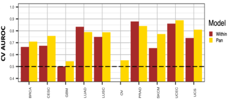

> ###  Hands-on: compare the ERBB2_KRAS_PIK3CA_AKT1 pan model with individual disease models
>
> 1. **PanCancer_compare_within_models**  with the following parameters:
>    -  *"pancancer summary folder data"*: `output_alt_folder` (output of **PanCancer_within_disease_analysis** )
{: .hands_on}

>   *Check parameter descriptions*
>
	Pancancer_Aberrant_Pathway_Activity_Analysis scripts/compare_within_models.R:
        --within_dir        String of the Directory location of where pan within cancer-type data is
        --pancan_summary    String of the Directory location of where pan classifier summary is
        --alt_gene          String of the Directory location of classifier summary for alt gene
      
      Output:
      - Process PanCancer Classifier and within disease/cancertype summary files and generate
       AUROC and AUPR comparion files ("auroc_comparison.pdf" and "aupr_comparison.pdf")
      - Process altgene classifier summary and altgene within disease/cancertypes summary files
       and process pancan_alt_summary file to determine alternative classifier prediction
       performance on alternative gene ("alt_gene_auroc_comparison.pdf" and "alt_gene_aupr_comparison.pdf")
{: .hands_on}

## **apply_weights**
In this step we would like to predict y status (mutational status) using x matrix (gene expression). Subset the x matrix to MAD genes, scaling the expression and add covariate information. A logit transformation will be applied to output probabilities and classifier decisions. 

> ###  Hands-on: Apply weights for ERBB2_KRAS_PIK3CA_AKT1 model
>
> 1. **PanCancer_apply_weights**  with the following parameters:
>    -  *"Classifier data"*: `output_alt_folder` (output of **PanCancer_compare_within_models** )
>    -  *"Filename of features to use in model"*: `output` (Input dataset)
>    -  *"Filename mutations"*: `output` (Input dataset)
>    -  *"Filename of mutation burden"*: `output` (Input dataset)
>    -  *"Filename of sample"*: `output` (Input dataset)
>    - *"Supplement Y matrix with copy number events"*: `Yes`
{: .hands_on}

>    *Check parameter descriptions*
>
	 Pancancer_Aberrant_Pathway_Activity_Analysis scripts/apply_weights.py:
      --classifier                          String of the location of classifier file
      --copy_number                         Supplement Y matrix with copy number events
      --x_matrix                            Filename of features to use in model
      --filename_mut                        Filename of sample/gene mutations to use in model
      --filename_mut_burden                 Filename of sample mutation burden to use in model
      --filename_sample                     Filename of patient/samples to use in model
      --filename_copy_loss                  Filename of copy number loss
      --filename_copy_gain                  Filename of copy number gain
      --filename_cancer_gene_classification Filename of cancer gene classification table
      
      Output:
      - Generates .tsv file of classifier scores and other covariate info for plotting creates
       "classifier_decisions.tsv" file and Apply a logit transform [y = 1/(1+e^(-wX))] to output probabilities
{: .hands_on}

## **Visualize_decisions**
In this step we generate plots for each disease and plot  total decision and hypermutated samples.
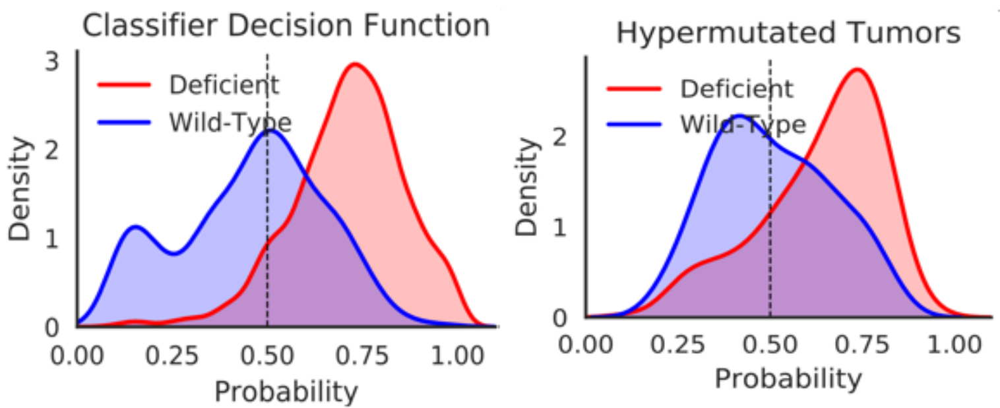

> ###  Hands-on: Visualize decisions for ERBB2_KRAS_PIK3CA_AKT1 model
>
> 1. **PanCancer_visualize_decisions**  with the following parameters:
>    -  *"Classifier score data"*: `output_alt_folder` (output of **PanCancer_apply_weights** )
{: .hands_on}

> *Check parameter descriptions*
>
	Pancancer_Aberrant_Pathway_Activity_Analysis scripts/visualize_decisions.py:
        --scores  String of the folder location of classifier_decisions.tsv
        --custom  comma separated list of columns to plot
                  (optional: True)
      
      Output:
      - Visualize decision function for all samples ("total_decisions.pdf") 
      - Plot disease type specific decision functions ("decision_plot_{}.pdf")
      - Visualize decision function for hyper mutated tumors ("hyper_mutated.pdf")
{: .hands_on}

## **map_mutation_class**
In this step we combined variant level information for each mutation combining with classifier decisions and predictions.

> ###  Hands-on: map mutation class for ERBB2_KRAS_PIK3CA_AKT1 model
>
> 1. **PanCancer_map_mutation_class**  with the following parameters:
>    -  *"Classifier score data"*: `output_alt_folder` (output of **PanCancer_visualize_decisions** )
>    -  *"string of the genes to extract or genelist file"*: `output` (Input dataset)
>    - *"Supplement Y matrix with copy number events"*: `Yes`
>    -  *"Filename of raw mut MAF"*: `output` (Input dataset)
{: .hands_on}

>    *Check parameter descriptions*
>
	Pancancer_Aberrant_Pathway_Activity_Analysis scripts/map_mutation_class.py:
      --scores              String of the location of folder containing classifier_decisions.tsv
      --path_genes          comma separated string of HUGO symbols for all genes in the pathway or Pathway genes list file
      --filename_copy_loss  Filename of copy number loss
      --filename_copy_gain  Filename of copy number gain
      --filename_raw_mut    Filename of raw mut MAF
        
      Output:
      - Merge per sample classifier scores with mutation types present in each sample
       and generate "mutation_classification_scores.tsv" file
{: .hands_on}

## **alternative_genes_pathwaymapper**
In this step we combine classifier weights,copy number information, recalulate metrics for positive samples, visuvalize distribution for AUROC and AUPR for all genes and metrics for each gene. 

> ###  Hands-on: alternative genes pathway mapper for ERBB2_KRAS_PIK3CA_AKT1 model
>
> 1. **PanCancer_alternative_genes_pathwaymapper**  with the following parameters:
>    -  *"Classifier score data"*: `output_alt_folder` (output of **PanCancer_map_mutation_class** )
>    - *"Comma separated string of HUGO gene symbols"*: `ERBB2,PIK3CA,KRAS,AKT1`
>    -  *"string of the genes to extract or genelist file"*: `output` (Input dataset)
>    -  *"Filename mutations"*: `output` (Input dataset)
>    -  *"Filename of sample"*: `output` (Input dataset)
>    - *"Supplement Y matrix with copy number events"*: `Yes`
{: .hands_on}

>    *Check parameter descriptions*
>
	Pancancer_Aberrant_Pathway_Activity_Analysis scripts/targene_alternative_genes_pathwaymapper.py:
      --genes                               comma separated string of HUGO symbols for target genes or targenes_list.csv file
      --path_genes                          comma separated string of HUGO symbols for all genes in the target pathway or path_genes.csv file
      --scores                              String of the location of classifier scores/alt_folder
      --filename_mut                        Filename of sample/gene mutations to use in model
      --filename_mut_burden                 Filename of sample mutation burden to use in model
      --filename_sample                     Filename of patient/samples to use in model
      --filename_copy_loss                  Filename of copy number loss
      --filename_copy_gain                  Filename of copy number gain
      
      Output:
      - calculate and display metrics for targen classification
      - calulate and display pathway metrics ("pathway_metrics_pathwaymapper.txt")
      - Visualize Distribution of AUROC and AUPRC for all genes and Get Metrics for All Genes
       ("all_gene_metric_ranks.tsv")
{: .hands_on}

## **pathway_count_heatmaps**
This step generates combined heatmap from mutation and copy number information and summarizes mutation, copy and total counts per sample for the entire pathway. 
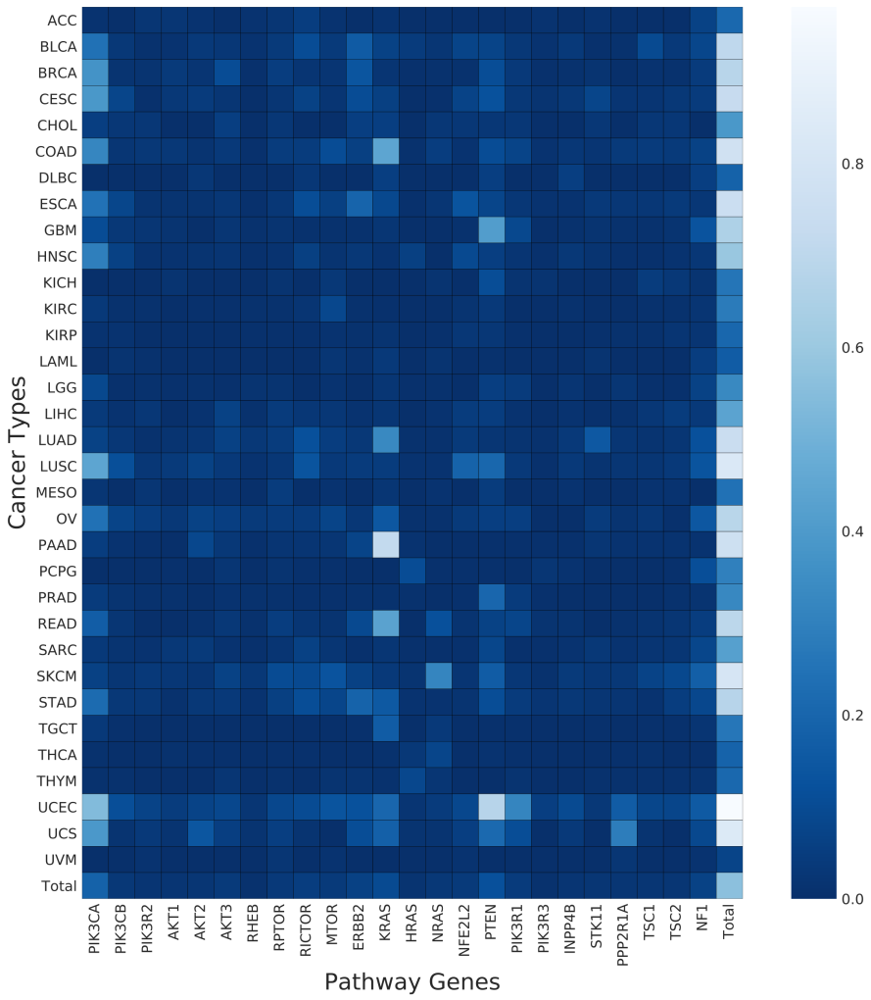

> ###  Hands-on: Heatmaps for ERBB2_KRAS_PIK3CA_AKT1 model
>
> 1. **PanCancer_pathway_count_heatmaps**  with the following parameters:
>    -  *"Classifier score data"*: `output_alt_folder` (output of **PanCancer_alternative_genes_pathwaymapper** )
>    - *"Comma separated string of HUGO gene symbols"*: `ERBB2,PIK3CA,KRAS,AKT1`
>    -  *"String of the pathway genes to extract"*: `output` (Input dataset)
>    -  *"Filename of features to use in model"*: `output` (Input dataset)
>    -  *"Filename mutations"*: `output` (Input dataset)
>    -  *"Filename of mutation burden"*: `output` (Input dataset)
>    -  *"Filename of sample"*: `output` (Input dataset)
>    -  *"File with Copy number loss"*: `output` (Input dataset)
>    -  *"File with Copy number gain"*: `output` (Input dataset)
>    -  *"File with cancer gene classification table"*: `output` (Input dataset)
{: .hands_on}

>    *Check parameter descriptions*
>
	Pancancer_Aberrant_Pathway_Activity_Analysis scripts/targene_pathway_count_heatmaps.py:
      --genes                               comma separated string of HUGO symbols for target genes or targenes_list.csv file
      --path_genes                          comma separated string of HUGO symbols for all genes in the target pathway or path_genes.csv file
      --scores                              String of the location of classifier scores/alt_folder
      --x_matrix                            Filename of features to use in model
      --filename_mut                        Filename of sample/gene mutations to use in model
      --filename_mut_burden                 Filename of sample mutation burden to use in model
      --filename_sample                     Filename of patient/samples to use in model
      --filename_copy_loss                  Filename of copy number loss
      --filename_copy_gain                  Filename of copy number gain
      --filename_cancer_gene_classification Filename of cancer gene classification table
      
      Output:
      - Mutation, Copy Number, and Total Heatmaps (Gene by Cancer-type).
      - Calculates Mutations and copy number percentages of the genes in the 
       and generates "pathway_mapper_percentages.txt" file. 
      - Summarizes mutation, copy, and total counts per sample by targene pathway
       and generates "path_events_per_sample.tsv" file
{: .hands_on}

## **targene_summary_figures**
This step generates plots summarizing various analysis, including heatmaps for distribution of aberrant events across tumors, distirbution of predictions at variant level,summary distribution of PTEN variants R130X and R233X.

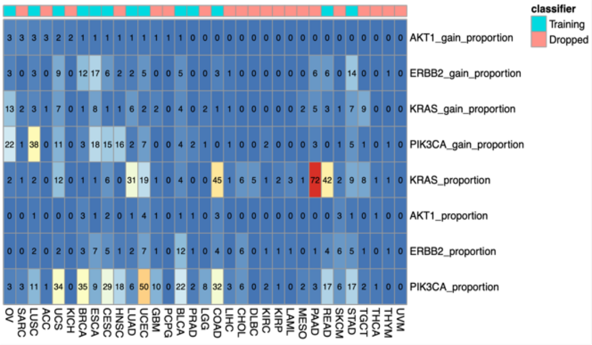

> ###  Hands-on: Summary figures for ERBB2_KRAS_PIK3CA_AKT1 model
>
> 1. **PanCancer_targene_summary_figures**  with the following parameters:
>    -  *"Classifier score data"*: `output_alt_folder` (output of **PanCancer_pathway_count_heatmaps** )
{: .hands_on}

>    *Check parameter descriptions*
>
	Pancancer_Aberrant_Pathway_Activity_Analysis scripts/viz/targene_summary_figures.R:
      --classifier_folder   String of the location of classifier data
      
      Output:
      - Heatmaps of the distribution of aberrant events across tumors ("targene_heatmap.pdf" and "all_targene_heatmap.pdf")
      - Gene weights/Coefficients contributing to the model (targene_coef_plot.pdf)
      - Plot distributions of predictions according to variant classification for OG and TSG
       ("variant_gain_fill_map.pdf" and "variant_loss_fill_map.pdf")
      - Plot summary distribution of PTEN variants R130X and R233X prediction scores using OG based classifer("PTEN_R130X_R233X_gain_distribution.pdf")
      - Plot summary distribution of PTEN variants R130X and R233X prediction scores using TSG based classifer("PTEN_R130X_R233X_loss_distribution.pdf")
      - Targene Summary Counts Distribution ("path_events_per_sample.tsv")
      - Targene pathway events counts ("targene_pathway_events_counts.pdf")
      - Performance Metrics Distribution across pathway members
       ("aupr_distribution.pdf" and "auroc_distribution.pdf")
      - T-Test for AUPR between targene pathway genes and Other genes
       ("targene_pathway_variant_AUPR_ttest.txt")
{: .hands_on}

## **targene_cell_line_predictions**
In this step we use our classifier information and predict mutational status for various cell lines in CCLE and GDSC data sources.
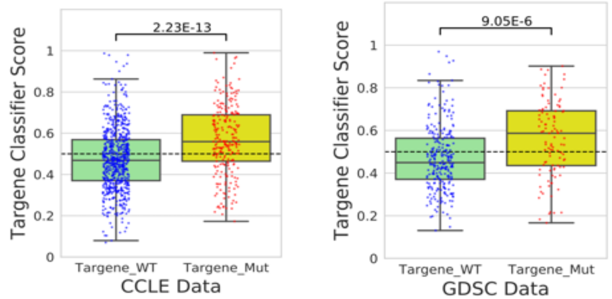

> ###  Hands-on: Analysis of CCLE and GDSC celllines using ERBB2_KRAS_PIK3CA_AKT1 model
>
> 1. **PanCancer_targene_cell_line_predictions**  with the following parameters:
>    -  *"classifier summary folder data"*: `output_alt_folder` (output of **PanCancer_targene_summary_figures** )
>    - *"Comma separated string of HUGO targene symbols"*: `ERBB2_MUT,PIK3CA_MUT,KRAS_MUT,AKT1_MUT`
>    -  *"string of the genes to extract or genelist file"*: `output` (Input dataset)
>    -  *"Filename ccle rnaseq data"*: `output` (Input dataset)
>    -  *"Filename ccle mutational data"*: `output` (Input dataset)
>    -  *"Filename ccle variant data"*: `output` (Input dataset)
>    -  *"Filename gdsc rnaseq data"*: `output` (Input dataset)
>    -  *"Filename gdsc mutational data"*: `output` (Input dataset)
>    -  *"Filename for gdsc1 pharmacological data file"*: `output` (Input dataset)
>    -  *"Filename for gdsc2 pharmacological data file"*: `output` (Input dataset)
{: .hands_on}

>   *Check parameter descriptions*
>
	Pancancer_Aberrant_Pathway_Activity_Analysis scripts/viz/targene_cell_line_predictions.py:
      --targenes        comma separated string of HUGO symbols for target genes or targenes_list.csv file
      --path_genes      comma separated string of HUGO symbols for all genes in the target pathway or path_genes.csv file
      --classifier      String of the location of classifier_summary file
      --ccle_rnaseq     Filename of CCLE gene expression data file
      --ccle_mut        Filename of CCLE cell lines/gene mutations data file
      --ccle_maf        Filename of CCLE mutational variant level data file
      --gdsc_rnaseq     Filename of GDSC gene expression data file
      --gdsc_mut        Filename of GDSC cell lines/gene mutations data file
      --gdsc1_phar      Filename of GDSC1 pharmocological response data
      --gdsc2_phar      Filename of GDSC2 pharmocological response data
      
      Output:
      - Generate predictions for CCLE data using targene classifier(ccle_histogram.png)
      - Generate classifier scores for CCLE cell lines and combines CCLE mutational data
       and variant data with classifier scores (ccle_targene_classifier_scores.tsv).
      - Performes t-test on classifier weights across targene mutant vs targene wildtype cell-line groups(ccle_targene_WT_MUT_predictions.pdf)
      - add CCLE nucleotide scores at variant level and update nucleotide_mutation_scores.tsv
       (updated_Data_nucleotide_scores.csv)
      - add CCLE protein scores at variant level and update aminoacid_mutation_scores.tsv
       (updated_Data_aminoacid_scores.csv)
      - Generate predictions for GDSC data using targene classifier(gdsc_scores_histogram.png)
      - Generate classifier scores for GDSC cell lines and combines CCLE mutational data
       and variant data with classifier scores (gdsc_targene_classifier_scores.tsv).
      - Performes t-test on classifier weights across targene mutant vs targene wildtype cell-line groups(gdsc_targene_WT_MUT_predictions.pdf)
      -Apply GDSC classifier scores to evaluate GDSC1 pharmacologial data response
      (gdsc1_targene_pharmacology_predictions.tsv)
      -Apply GDSC classifier scores to evaluate GDSC2 pharmacologial data response
      (gdsc2_targene_pharmacology_predictions.tsv)
      -Apply CCLE classifier scores to evaluate GDSC1 pharmacologial data response
      (gdsc1_ccle_targene_pharmacology_predictions.tsv)
      -Apply CCLE classifier scores to evaluate GDSC2 pharmacologial data response
      (gdsc2_ccle_targene_pharmacology_predictions.tsv)
{: .hands_on}

## **external_sample_status_prediction**
In this step we use our classifier information and predict mutational status for PTENKO, PI3KCA mutant, WT when PI3K is inhibited using A66. 
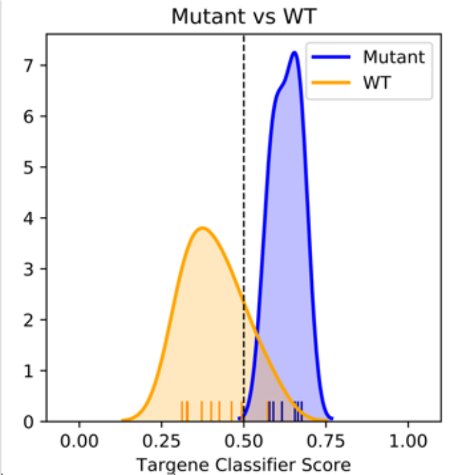


> ###  Hands-on: external sample evaluation with ERBB2_KRAS_PIK3CA_AKT1 model
>
> 1. **PanCancer_external_sample_status_prediction**  with the following parameters:
>    -  *"classifier summary folder data"*: `output_alt_folder` (output of **PanCancer_targene_cell_line_predictions** )
>    -  *"external sample gene expression data"*: `output` (Input dataset)
>    -  *"given mutational status"*: `output` (Input dataset)
{: .hands_on}

>    *Check parameter descriptions*
>
	Pancancer_Aberrant_Pathway_Activity_Analysis scripts/targene_alternative_genes_pathwaymapper.py:
      --classifier          String of the location of classifier scores/alt_folder
      --ex_vlog             File path for external sample expression data file[fpkm/rlog/vlog values]
      --sign                assigned tumor [1] or normal [-1] sample mutational status
      
      Output:
      - compare and perform t-test significance calculation of perdicted scores
       between external normal and tumor samples ("targene_external_sample_predictions.pdf and targene_external_sample_predictions_1.pdf")
{: .hands_on}

## **targene_pharmacology**
In this step we use the classifier derived cell line predictions and use them to evaluate pharmocological response of these cell lines. We plot log IC50 with classifier scores for each cell line and draw a correlation for drug response in absensce or presence of targene mutations

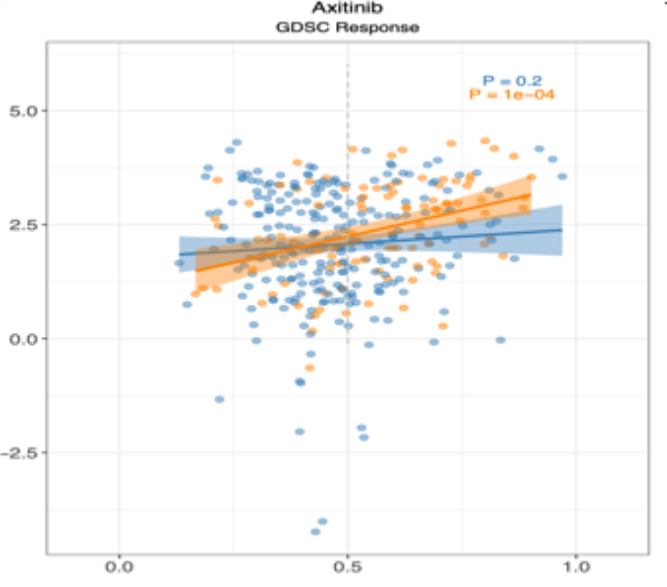

> ###  Hands-on: GDSC1 and GDSC2 pharmacological analysis using ERBB2_KRAS_PIK3CA_AKT1 model
>
> 1. **PanCancer_targene_pharmacology**  with the following parameters:
>    -  *"classifier summary folder data"*: `output_alt_folder` (output of **PanCancer_external_sample_status_prediction** )
>    -  *"Filename list of compounds"*: `output` (Input dataset)
{: .hands_on}

>    *Check parameter descriptions*
>
	Pancancer_Aberrant_Pathway_Activity_Analysis scripts/viz/targene_pharmacology.R:
      --classifier    String of the location of classifier folder
      --compound      Filename of list of pharmocological compounds for evaluation\
      
      Output:
      - Scatter plots with visualizing drug response compared to GDSC targene classifier scores
       for GDSC1 pharmacological dataset (GDSC1_targene_all_drug_response.pdf)  
      - Scatter plots with visualizing drug response compared to CCLE targene classifier scores
       for GDSC1 pharmacological dataset (GDSC1_ccle_targene_all_drug_response.pdf)
      - Scatter plots with visualizing drug response compared to GDSC targene classifier scores
       for GDSC2 pharmacological dataset (GDSC2_targene_all_drug_response.pdf)  
      - Scatter plots with visualizing drug response compared to CCLE targene classifier scores
       for GDSC2 pharmacological dataset (GDSC2_ccle_targene_all_drug_response.pdf)
{: .hands_on}

> ###  Questions
>
> 1. Can you build a classifer for tumor suppressor gene combination in PI3K pathway?
> 2. how did the PI3K_LOSS model performed compared to PI3K_GAIN?
>
> > ###  Solution
> >
> > 1. Try buiding a model using (PTEN,PIK3R1,STK11 genes and BRCA,COAD,ESCA,HNSC,LGG,LUAD,LUSC,PRAD,READ,GBM,UCEC,UCS cancer-types)
> > 2. Check the AUROC and AUPR values. 
> >
> {: .solution}
>
{: .question}
>
# **Conclusions**
{:.no_toc}

Sum up the tutorial and the key takeaways here. We encourage adding an overview image of the
pipeline used.